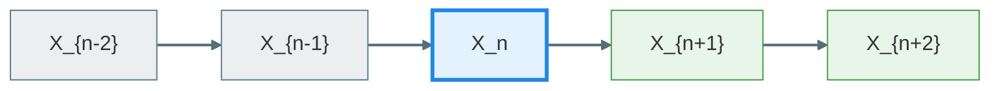

# Discrete - time Markov chain
考虑事件列 $X_1, \cdots,X_n,X_{n+1}$ 的联合分布, 可以做分解
$$P(X_1,\cdots,X_{n+1})=P(X_1,\cdots,X_n)P(X_{n+1}\mid X_1,\cdots,X_n)=\cdots$$
Markov chain 就是对上面的分解做一些假设, 我们称 $i<n$ 的事件 $X_i$ 叫过去, $i> n$ 的事件 $X_i$ 为未来, 事件 $X_n$ 为现在
Markov chain 的假设即: 未来的状态只取决于现在的状态 $X_n$ , 而与过去的状态无关

对于任何事件, 都可以处于某个状态中

##### Conditional independence
Markov chain 的假设为
$$P(X_{n+1}\mid X_1,\cdots,X_n)=P(X_{n+1}\mid X_n)$$
记为
$$\left(X_1,\cdots,X_{n-1}\right) -X_n-X_{n+1}$$
同样有等价刻画
$$P( X_{n+1},X_1,\cdots,X_{n-1}\mid X_n)=P(X_{n+1}\mid X_n)P(X_0,\cdots,X_{n-1}\mid X_n)$$

##### 定义 DTMC
事件列 $(X_n)$ 是一个 Markov chain 若满足
$$P(X_{n+1}\mid X_n,\cdots,X_0)=P(X_{n+1}\mid X_n)\quad \forall n$$ 称 $P(X_{n+1}=j\mid X_n=i)=p_n(i,j)$ 为转移概率 Transition probability
同时, 若 $p_n(i,j)=p(i,j)$ , 则称这个 Markov chain 为时齐的 time - homogeneity / temporally

>[!examples] coupon collector
>$X_n:\text{number of distinct types at time n ( N total)}$ 假设每种抽到的概率相同
>$$P(X_{n+1}=k+1\mid X_n =k)=1-\frac{k}{N}\quad P(X_{n+1}=k\mid X_n=k)=\frac{k}{N}$$
>对于其他状态, 概率皆为 0 即: $P(X_{n+1}=j\mid X_n=k)=0\quad j\neq k,k+1$    
>```mermaid
flowchart LR
D[...] --> A
A[k-1] -. "1-(k-1)/N" .-> B[k]
B -. "1-k/N" .-> C[k+1]
C --> E[...]
>
>%% 节点颜色
>style A fill:#E3F2FD,stroke:#1E88E5,stroke-width:2px
style B fill:#E8F5E9,stroke:#43A047,stroke-width:2px
style C fill:#FFF3E0,stroke:#FB8C00,stroke-width:2px
style D fill:#F3E5F5,stroke:#8E24AA,stroke-width:2px
style E fill:#F3E5F5,stroke:#8E24AA,stroke-width:2px
>
%% 线条颜色
linkStyle default stroke:#546E7A,stroke-width:2px
>```

转移概率的信息可以被矩阵储存, 称为转移概率矩阵
可以定义首达时间
$$\tau =\inf\{n:X_n=N\}:\Omega\to \mathbb{R}$$
>对于现实中的抽卡, 具有非均匀的概率, 如何建立 Markov 模型
>实际上是给状态一个好的定义, 一种定义方式是在状态中显式区分不同概率卡的种类 $[X_{n,k}]_k$ 表为状态向量
>最极端的划分即为: 将状态定义已获得的卡 (区分每个种类)

>[!examples] Random walk / gambler‘s ruin
> $X_n:\text{wealth of time n}$ 转移概率为
> $$P(X_{n+1}=k+1\mid X_0=i,\cdots ,X_{n}=k)=p\quad P(X_{n-1}=k-1\mid X_0=i,\cdots,X_n=k)=1-p$$
>同时有终止条件
>$$\text{Quit if} \,X_n=0 \,\text{or}\, X_n=N$$ 称之为吸收态

##### sample path
给定  $\omega\in \Omega$ ,  $(n,X_n(\omega))$ 可以形成一条 path , 叫 sample path
所以也可以认为一个随机过程是指这些所有 sample path

传递矩阵有等价刻画: 
$$\text{Transition matrix}\Leftrightarrow \text{(row) stochastic matrix}\begin{cases}0\leq p(i,j)\leq 1\\ \sum_{j}p(i,j)=1\quad \forall i\end{cases}$$ 

>若 $X_{n+1}$ 不仅依赖于 $X_n$ , 还依赖于 $X_{n-1}$ 是否可以等价地用 Markov chain 刻画
>同样做法是定义一个好的状态, 可以将两个状态定义为一个新状态 $(X_n,X_{n-1})=S_n$ 则
>$$P(S_{n+1}|S_{n},\cdots,S_0)=P(X_{n+1},X_{n}\mid X_n,X_{n-1},\cdots,X_0)=P(X_{n+1},X_n\mid X_n,X_{n-1})=P(S_{n+1}\mid S_{n})$$
>这种做法叫 lifting state space

## Multistep transition
现在不止考虑一步转移, 考虑多步转移 $X_0=i$ , 先看两步
$$\begin{align}P(X_1=j,X_2=k\mid X_0=i)&=P(X_2=k\mid X_1=j,X_0=i)P(X_1=j\mid X_0=i)\\&=p(i,j)p(j,k) \end{align}$$
若 $P(X_0=i)=q(i)$ 则 joint pmf
$$P(X_0=i,X_1=j,X_2=k)=q(i)p(i,j)p(j,k)$$
同样两步转移
$$P(X_2=k\mid X_0=i)=\sum_{j}P(X_2=k,X_1=j\mid X_0=i)=\sum_j p(i,j)p(j,k)=p^2(i,k)$$
对于一般情况, 有

##### Champan - Kolmogorov equation
$$\begin{align}P(X_{n+m}=j\mid X_0=i)&=\sum_{k}P(X_m=k,X_{n+m=j}\mid X_0=i)\\&=\sum_{k}P(X_m=k\mid X_0=i)P(X_{m+n}=j\mid X_m=k,X_0=i)\\&=\sum_{k}P(X_m=k\mid X_0=i)P(X_{m+n=j}\mid X_m=k)\end{align}$$
#### Theorem 
对时齐 Markov chain, 有
$$P(X_{n+m}=j\mid X_m=i)=(p^n)(i,j)$$

考察 marginal distribution of $X_n$ 
$$P(X_n=i)=\sum_{k}P(X_n=i\mid X_0=k)P(X_0=k)=\sum_k q(k)p^n(k,i)=(\mathbf{q}\mathbf{P}^n)_i$$
即 $q_n=q\cdot p^n=q_{n-1}p$ 

对于非时齐 time - inhomogeneous 的过程, 我们也有
定义 $H_{st}(i,j)\coloneqq P(X_t=j\mid X_s=i)$ , 那么 C - K equation 有形式
$$r<s<t\quad H_{rt}=H_{rs}\cdot H_{st}$$

>这种结构实际上是半群, 称为 Markov 半群

>[!examples] Markov reward process
>visit state $j$ , reward $f(j)$ 在 $k$ 时刻的 reward 也是一个随机变量 $f(X_k)$ 
>想给每个状态给一个加权函数: total reward $r(i):\text{total reward at state i}$ 的期望
>$$\begin{align}r(i) &=\mathbb{E}\left[\sum_{k=0}^nf(X_k)\Bigg| X_0=i\right]=\sum_{k=0}^n\mathbb{E}[f(X_k)\mid X_0=i]\\&=\sum_{k=0}^n \sum_{j}f(j)P(X_k=j\mid X_0=i)\\&=\sum_{k=0}^n\sum_{j}f(j)p^k(i,j)=\left((1+p+\cdots +p^n)f\right)_i\end{align}$$
>这是一种强化学习的建模, 即给每个状态打分

## Classification of state

##### Define
态 $j$ 是从态 $i$ 可达的 reachable : $i$ communicate with $j$  , $i\mapsto j$ , 若
$$P(X_n=j\mid X_0=i)>0\quad\exists n$$

##### Lemma 
可达是传递的: $i\mapsto j\, ,\,j\mapsto k\implies i\mapsto k$ 
这可以由 C - K 方程直接得到

>做一个符号的简化
>$$P_i(\cdot)\coloneqq P(\cdot\mid X_0=i)$$
>同样期望也有形式
>$$\mathbb{E}_i[\cdot]\coloneqq \mathbb{E}[\cdot\mid X_0=i]$$

##### Define
返回时间 : time of return state $j$ 
$$T_j=\inf\{n\geq 1:X_n=j\}$$
同样有 从 $i$ 到 $j$ 的概率和返回概率
$$\rho_{ij}=P_i(T_j<+\infty)\quad \rho_{jj}=P_{j}(T_j<+\infty)$$
则有
$$\{T_j<+\infty\}=\bigcup_{n=1}^{\infty}\{T_j=n\}$$
于是有可达的等价定义
$$i\mapsto j \Leftrightarrow \rho_{ij}>0$$
