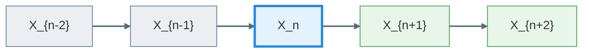

# Discrete - time Markov chain
考虑事件列 $X_1, \cdots,X_n,X_{n+1}$ 的联合分布, 可以做分解

$$
P(X_1,\cdots,X_{n+1})=P(X_1,\cdots,X_n)P(X_{n+1}\mid X_1,\cdots,X_n)=\cdots
$$

Markov chain 就是对上面的分解做一些假设, 我们称 $i<n$ 的事件 $X_i$ 叫过去, $i> n$ 的事件 $X_i$ 为未来, 事件 $X_n$ 为现在
Markov chain 的假设即: 未来的状态只取决于现在的状态 $X_n$ , 而与过去的状态无关

对于任何事件, 都可以处于某个状态中

##### Conditional independence
Markov chain 的假设为

$$
P(X_{n+1}\mid X_1,\cdots,X_n)=P(X_{n+1}\mid X_n)
$$

记为

$$
\left(X_1,\cdots,X_{n-1}\right) -X_n-X_{n+1}
$$

同样有等价刻画

$$
P( X_{n+1},X_1,\cdots,X_{n-1}\mid X_n)=P(X_{n+1}\mid X_n)P(X_0,\cdots,X_{n-1}\mid X_n)
$$

##### 定义 DTMC
事件列 $(X_n)$ 是一个 Markov chain 若满足

$$
P(X_{n+1}\mid X_n,\cdots,X_0)=P(X_{n+1}\mid X_n)\quad \forall n
$$

称 $P(X_{n+1}=j\mid X_n=i)=p_n(i,j)$ 为转移概率 Transition probability
同时, 若 $p_n(i,j)=p(i,j)$ , 则称这个 Markov chain 为时齐的 time - homogeneity / temporally

>[!examples] coupon collector
>$X_n:\text{number of distinct types at time n ( N total)}$ 假设每种抽到的概率相同
>
> $$
> P(X_{n+1}=k+1\mid X_n =k)=1-\frac{k}{N}\quad P(X_{n+1}=k\mid X_n=k)=\frac{k}{N}
> $$
>
>对于其他状态, 概率皆为 0 即: $P(X_{n+1}=j\mid X_n=k)=0\quad j\neq k,k+1$    
>```mermaid
flowchart LR
D[...] --> A
A[k-1] -. "1-(k-1)/N" .-> B[k]
B -. "1-k/N" .-> C[k+1]
C --> E[...]
>
>%% 节点颜色
>style A fill:#E3F2FD,stroke:#1E88E5,stroke-width:2px
style B fill:#E8F5E9,stroke:#43A047,stroke-width:2px
style C fill:#FFF3E0,stroke:#FB8C00,stroke-width:2px
style D fill:#F3E5F5,stroke:#8E24AA,stroke-width:2px
style E fill:#F3E5F5,stroke:#8E24AA,stroke-width:2px
>
%% 线条颜色
linkStyle default stroke:#546E7A,stroke-width:2px
>```

转移概率的信息可以被矩阵储存, 称为转移概率矩阵
可以定义首达时间

$$
\tau =\inf\{n:X_n=N\}:\Omega\to \mathbb{R}
$$

>对于现实中的抽卡, 具有非均匀的概率, 如何建立 Markov 模型
>实际上是给状态一个好的定义, 一种定义方式是在状态中显式区分不同概率卡的种类 $[X_{n,k}]_k$ 表为状态向量
>最极端的划分即为: 将状态定义已获得的卡 (区分每个种类)

>[!examples] Random walk / gambler‘s ruin
> $X_n:\text{wealth of time n}$ 转移概率为
>
> $$
> P(X_{n+1}=k+1\mid X_0=i,\cdots ,X_{n}=k)=p\quad P(X_{n-1}=k-1\mid X_0=i,\cdots,X_n=k)=1-p
> $$
>
>同时有终止条件
>
> $$
> \text{Quit if} \,X_n=0 \,\text{or}\, X_n=N
> $$
>
> 称之为吸收态

##### sample path
给定  $\omega\in \Omega$ ,  $(n,X_n(\omega))$ 可以形成一条 path , 叫 sample path
所以也可以认为一个随机过程是指这些所有 sample path

传递矩阵有等价刻画: 

$$
\text{Transition matrix}\Leftrightarrow \text{(row) stochastic matrix}\begin{cases}0\leq p(i,j)\leq 1\\ \sum_{j}p(i,j)=1\quad \forall i\end{cases}
$$

>若 $X_{n+1}$ 不仅依赖于 $X_n$ , 还依赖于 $X_{n-1}$ 是否可以等价地用 Markov chain 刻画
>同样做法是定义一个好的状态, 可以将两个状态定义为一个新状态 $(X_n,X_{n-1})=S_n$ 则
>
> $$
> P(S_{n+1}|S_{n},\cdots,S_0)=P(X_{n+1},X_{n}\mid X_n,X_{n-1},\cdots,X_0)=P(X_{n+1},X_n\mid X_n,X_{n-1})=P(S_{n+1}\mid S_{n})
> $$
>
>这种做法叫 lifting state space

## Multistep transition
现在不止考虑一步转移, 考虑多步转移 $X_0=i$ , 先看两步

$$
\begin{align}P(X_1=j,X_2=k\mid X_0=i)&=P(X_2=k\mid X_1=j,X_0=i)P(X_1=j\mid X_0=i)\\&=p(i,j)p(j,k) \end{align}
$$

若 $P(X_0=i)=q(i)$ 则 joint pmf

$$
P(X_0=i,X_1=j,X_2=k)=q(i)p(i,j)p(j,k)
$$

同样两步转移

$$
P(X_2=k\mid X_0=i)=\sum_{j}P(X_2=k,X_1=j\mid X_0=i)=\sum_j p(i,j)p(j,k)=p^2(i,k)
$$

对于一般情况, 有

##### Champan - Kolmogorov equation

$$
\begin{align}P(X_{n+m}=j\mid X_0=i)&=\sum_{k}P(X_m=k,X_{n+m=j}\mid X_0=i)\\&=\sum_{k}P(X_m=k\mid X_0=i)P(X_{m+n}=j\mid X_m=k,X_0=i)\\&=\sum_{k}P(X_m=k\mid X_0=i)P(X_{m+n}=j\mid X_m=k)\end{align}
$$

#### Theorem 
对时齐 Markov chain, 有

$$
P(X_{n+m}=j\mid X_m=i)=(p^n)(i,j)
$$

考察 marginal distribution of $X_n$ 

$$
P(X_n=i)=\sum_{k}P(X_n=i\mid X_0=k)P(X_0=k)=\sum_k q(k)p^n(k,i)=(\mathbf{q}\mathbf{P}^n)_i
$$

即 $q_n=q\cdot p^n=q_{n-1}p$ 

对于非时齐 time - inhomogeneous 的过程, 我们也有
定义 $H_{st}(i,j)\coloneqq P(X_t=j\mid X_s=i)$ , 那么 C - K equation 有形式

$$
r<s<t\quad H_{rt}=H_{rs}\cdot H_{st}
$$

>这种结构实际上是半群, 称为 Markov 半群

>[!examples] Markov reward process
>visit state $j$ , reward $f(j)$ 在 $k$ 时刻的 reward 也是一个随机变量 $f(X_k)$ 
>想给每个状态给一个加权函数: total reward $r(i):\text{total reward at state i}$ 的期望
>
> $$
> \begin{align}r(i) &=\mathbb{E}\left[\sum_{k=0}^nf(X_k)\Bigg| X_0=i\right]=\sum_{k=0}^n\mathbb{E}[f(X_k)\mid X_0=i]\\&=\sum_{k=0}^n \sum_{j}f(j)P(X_k=j\mid X_0=i)\\&=\sum_{k=0}^n\sum_{j}f(j)p^k(i,j)=\left((1+p+\cdots +p^n)f\right)_i\end{align}
> $$
>
>这是一种强化学习的建模, 即给每个状态打分

## Classification of states

##### Define
态 $j$ 是从态 $i$ 可达的 reachable : $i$ communicate with $j$  , $i\mapsto j$ , 若

$$
P(X_n=j\mid X_0=i)>0\quad\exists n
$$

##### Lemma 
可达是传递的: $i\mapsto j\, ,\,j\mapsto k\implies i\mapsto k$ 
这可以由 C - K 方程直接得到

>做一个符号的简化
>
> $$
> P_i(\cdot)\coloneqq P(\cdot\mid X_0=i)
> $$
>
>同样期望也有形式
>
> $$
> \mathbb{E}_i[\cdot]\coloneqq \mathbb{E}[\cdot\mid X_0=i]
> $$
>

##### Define
返回时间 : time of return state $j$ 

$$
T_j=\inf\{n\geq 1:X_n=j\}
$$

同样有 从 $i$ 到 $j$ 的概率和返回概率

$$
\rho_{ij}=P_i(T_j<+\infty)\quad \rho_{jj}=P_{j}(T_j<+\infty)
$$

则有

$$
\{T_j<+\infty\}=\bigcup_{n=1}^{\infty}\{T_j=n\}
$$

于是有可达的等价定义

$$
i\mapsto j \Leftrightarrow \rho_{ij}>0
$$

##### Define
称 $T$ 是一个 Stopping time, 若 $\{T=n\}$ 被 $X_0 ,\cdots, X_n$ 决定 (或者 $\{T=n\}\in \sigma(X_0,\cdots,X_n)$)

对返回时间有相同的分解

$$
\{T_j=n\}=\{X_1,\cdots,X_{n-1}\neq j,X_n=j\}
$$

这也是一个随机变量 $T_j\colon \Omega \to \mathbb{R}$ 

同样也可以定义 $k$ 次返回时间

$$
T^k_j=\inf\{n>T^{k-1}:X_n=j\}
$$

>这也是一个 stopping time

##### Define Strong Markov Property
将 markov 性质推广到 stopping time 上:
对于一个 stopping time $T$ 

$$
P(X_{T+1}=j|X_{T}=i,T=n,(X_0,\cdots,X_{T-1})\in A)=p(i,j)
$$

>在一般的情况, 这和 markov 性不同, 但在离散时间, 离散状态, 时间齐次的 markov chain 下, 两者是一样的
>对于连续时间, 连续状态的情况有些许不同

这种情况可以直接计算

$$
P(X_{T+1}=j,X_{T}=i,T=n,(X_0,\cdots,X_{T-1})\in A)=\sum _{ V_n}P(X_{n+1}=j,X_0=x_0,\cdots,X_n=i )
$$

这里 

$$
V_n=\{(X_0,\cdots,X_n):X_{T}=i,T=n,(X_0,\cdots,X_{T-1})\in A\}
$$

则为

$$
\sum_{V_n}P(X_{0}=x_0,\cdots,X_n=j)\cdot p(i,j)=p(i,j)\cdot P(X_T=i,T=n,(X_0,\cdots,X_{T-1})\in A)
$$

##### Theorem
若 $X$ 为一个 DTMC , $T$ 是一个 stopping time

$$
\{(X_{T+k})_{k\ge0}\mid T=n,X_T=i\}
\stackrel{d}{=}
\{(X_k)_{k\ge0}\mid X_0=i\}
$$

这可以帮我们理解 returning time

$$
\begin{align}P_{j}(T^2_j<+\infty)&=\sum_{n}P(T_j^2<+\infty,T_j=n)\\&=\sum_{n}P(T_j^2<+\infty|T_j=n,X_{n}=j)P(T_j=n,X_n=j)\\&=\sum_{n}P(T_j<+\infty)P(T_j=n)\\&=\rho_{jj}^2\end{align}
$$

这立即得到

$$
P_j(T_j^2<+\infty|T_j<+\infty)=P_j(T_j<+\infty)
$$

同时

$$
P_j(T_j^k<+\infty)=\rho_{jj}^{k}\quad P_{i}(T_j^k<+\infty)=\rho_{ij}\rho_{jj}^{k-1}
$$

利用上面的工具, 可以很好地给不同状态分类
* Transient state: $\rho_{ii}<1$
* Recurrent state: $\rho_{ii}=1$

状态分类可以用另外一种语言, 用计数的语言

$$
N(j)=\sum_{n=1}^{\infty}\mathbf{1}_{\{X_n=j\}}
$$

则 

$$
\mathbb{E}_i[N(j)]=\sum_{n=1}^{\infty}P_i(X_n=j)=\sum_{n=1}^\infty p^n(i,j)=\sum_{k\geq 1}^{\infty}P_i(N(j)\geq k)
$$

而 

$$
P_i(N(j)\geq k)=P_i(T_j^k<+\infty)=\rho_{ij}\rho_{jj}^{k-1}
$$

最后

$$
\mathbb{E}_i[N(j)]=\frac{\rho_{ij}}{1-\rho_{jj}}
$$

从这也可以看出: 在无穷时间内, transient state 只会返回有限次, 但 recurrent state 会返回无穷次

##### Lemma
State $i$ 是一个 recurrent state iff 

$$
\sum_{n=1}^{\infty}p^n(i,i)=+\infty
$$

##### Lemma

$$
\rho_{ij}>0 \quad(i\mapsto j),\quad\rho_{ji}<1\implies i\text{ is transient state}
$$

Proof: 
$\exists n, P_i(X_n=j)>0$ , 于是可定义 $k=\min\{n:P_i(X_n=j)>0\}$ , 那么 $X_1,\cdots,X_{k-1}\neq j$ 

$$
P_{i}(T_i=\infty)\geq p(x_0,x_1)\cdots p(x_{n-1},x_n)P_{j}(T_i=\infty)>0
$$

>直觉是这个态应该会从 $j$ 处泄漏出去, 所以应该先刻画到 $j$ 态的情况, 给出下界

那么有 $\rho_{ii}<1$ 即为 transient state

##### Lemma
若 $i\mapsto j$ 而 $i$ 是一个 recurrent state, 这导致 $j$ 也是一个 recurrent state 
Proof:
先说明还有 $j\mapsto i$ , 即 $\exists n, P_j(X_n=i)>0$ , 如果不成立, 则 $\rho_{ji}<1$ , 则与上面的命题矛盾

所以

$$
\sum_{n=1}^{\infty}p^n(i,i)=\infty
$$

那么

$$
\begin{align}\sum_{n=1}^\infty p^n(j,j)\geq\sum_n p^{m}(j,i)p^n(i,i)p^k(i,j)=\infty\end{align}
$$

>注意最后一个求和只对 $n$ 进行

故状态空间的不同 recurrent state 和 transient state 进行了一个划分

##### Define
集 $S$ 是 closed 的, 若 $p(i,j)=0 \quad \forall i\in S,\forall j\notin S$

##### Lemma
$S\neq\emptyset$ 且是一个有限且闭合的集, 则存在 $s\in S$ 是 recurrent

>有点像聚点原理

对 $i\in S$ , $\sum_{j\in S}p^n(i,j)=1$ , 从而

$$
\sum_{j\in S}\frac{\rho_{ij}}{1-\rho_{jj}}=\sum_{j\in S}\mathbb{E}_i[N(j)]=\sum_{n}\sum_{j\in S}p^n(i,j)=\infty
$$

即 $\exists s$ 合于 $\rho_{ss}=1$

##### Define
集 $S$ 是不可约 irreducible 的, 若 

$$
i\mapsto j\quad\forall i,j\in S
$$

将两个集的性质合并在一起, 这样的集中所有的态都是 recurrent state

##### Theorem
非空集 $S$ 是不可约的有限闭集, 则所有态都是 recurrent state

##### Theorem
对 DTMC, 若状态空间 $S$ 有限, 则

$$
S=T\sqcup R_1\sqcup R_2\sqcup\cdots\sqcup R_k
$$

这里 $T$ 是 transient state , $R_i$ 是不可约的闭集, 包含 recurrent state

Proof:

>几乎是数数问题

先定义

$$
T=\{i:\exists j, i\mapsto j, j\not\mapsto i\}
$$

然后找 $S\setminus T$ 剩下什么, 然后是归纳法: 若非空, 则存在 $i\in S\setminus T$ , 考察 $C_i=\{j:i\mapsto j\}$ , 这其中的态都能到 $i$ 
再看这是否是一个闭集, 传递性: $i\mapsto j\mapsto l$ , 这导致 $i\mapsto l\implies l\in C_i$ 
再考察是否可约, 同样以 $i$ 态作为中介 $j\mapsto i\mapsto l$ 对任意 $j,l\in C_i$ 然后再考察 $S-T-C_i$ 直到最后得到空集为止
由于 $S$ 有限, 迭代算法会终止, 完成证明

上面的内容都在问 

$$
P_i(T_i<+\infty)\overset{?}{=} 1
$$

对有限状态, 这可以决定这是否是 recurrent 或者 transient

但对于无穷状态, 这一点就截然不同, 状态可能越跑越远, 因为状态数是无穷的. 即使给出了肯定的答复, 也需要问: 到底需要多少时间才能回到
即需要考察 

$$
\mathbb{E}_i[T_i]\overset{?}{<}+\infty
$$

若是, 称为 positive recurrent, 反之为 null recurrent

## Steady state / Limit Behavior

这实际上在问

$$
p^n(i,j)\overset{?}{\to} \pi(j)\quad \text{as} \quad n\to\infty,\forall i
$$

分布会不会收敛到一个与初值无关的分布
即问

$$
X_0\sim q\quad X_n\sim q_n\quad q_n(j)=\sum q(i)p^n(i,j)\to\pi(j)
$$

>一个例子, 考虑 transition matrix
>
> $$
> \begin{bmatrix}1-a & a \\b&1-b\end{bmatrix}
> $$
>
> $q_n(0) = (1-a) q_{n-1}(0) + b q_{n-1}(1)=(1-a-b)q_{n-1}(0)+b$ , 然后这个稳态分布的条件是 $|1-a-b|<1$

